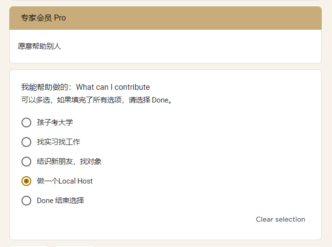
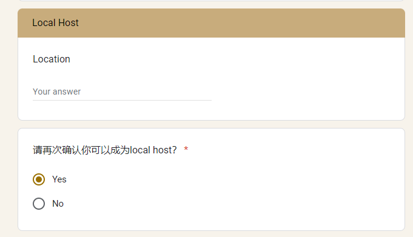
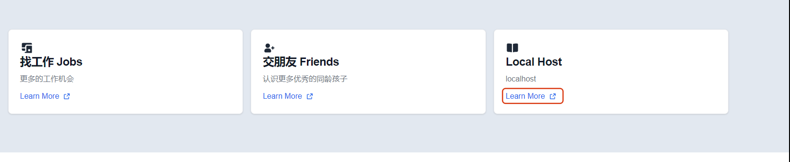
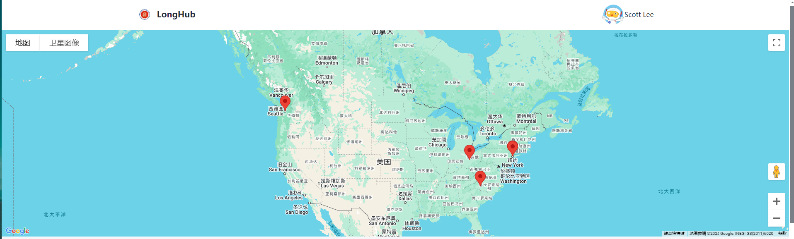
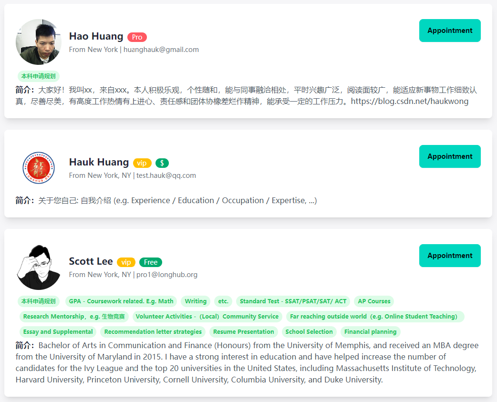
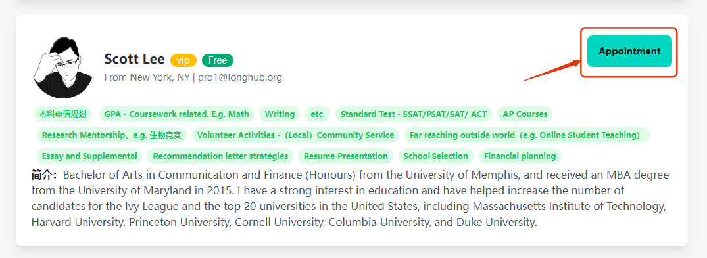

## 城市达人-专家

## 一、注册专家

进入LongHub官网：[https://longhub.org/](https://longhub.org/)

点击页面的`为了下一代 加入我们`按钮

### 1. 填写注册信息

填写注册表单，填写完成后会有注册信息发送到邮箱（注册填写的邮箱）

申请者选择填写成为我们的成为城市达人（填写时务必填写Zip Code）

填写能够提供的服务领域以及服务项目

### 2.获取注册信息

登录注册填写的邮箱，在收件箱可以获取我们的账号信息以及Profile链接

### 3.设置可预约时间段
点击`Appointment`，设置可预约、可预约项目以及可预约时间，点击`Add`即可生成可预约时间段

## 二、城市达人

点击LongHub首页的Local Host的`Learn More`，进入Local Host界面

即可看见Local Host地图，系统会根据申请人填写Zip Code，自动标注在地图上面
同时会有Host列表显示在地图下方

同时也可以查看其他城市达人，如有意向也可以点击联系人预约组织活动

