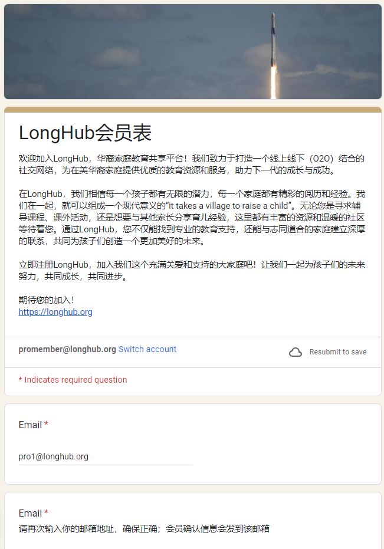
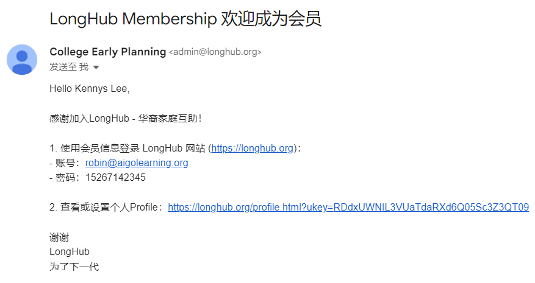
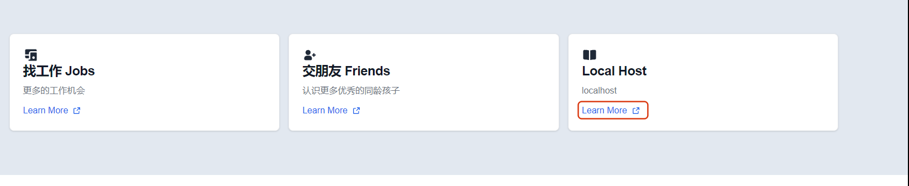
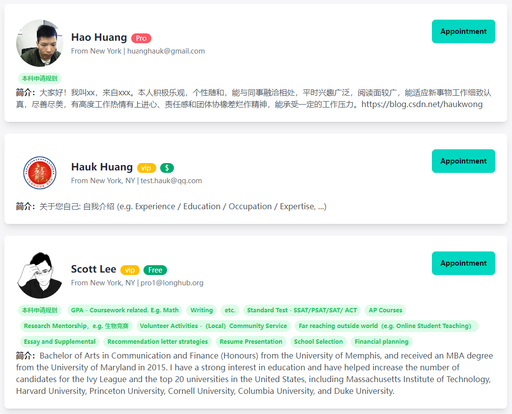

## 城市达人-普通会员

## 一、注册会员

进入LongHub官网：[https://longhub.org/](https://longhub.org/)

点击页面的`为了下一代 加入我们`按钮

### 1. 填写注册信息

填写注册表单，填写完成后会有注册信息发送到邮箱（注册填写的邮箱）

申请者选择填写成为我们的成为会员

### 2.获取注册信息

登录注册填写的邮箱，在收件箱可以获取我们的账号信息以及Profile链接

## 二、找城市达人

点击LongHub首页的Local Host的`Learn More`，进入Local Host界面

即可看见Local Host地图，所有的城市达人都会标注在地图上面
同时会有Host列表显示在地图下方

如需联系城市达人，可以直接点击地图的点或者在下方列表中查找并预约

## 三、预约咨询

### 1. 预约咨询时间

如果对他人上传的交友信息意向，可以点击联系人，进入他的Profile页面，点击`Appointment`，即可选择可预约咨询时间段

### 2. 预约邮件提醒

当预约咨询后，会有个邮件提醒（包含了预约时间段以及会议信息）

### 2. 我的预约

当预约完成后，同时会显示在Profile的我的预约列表（包含了预约时间段以及会议信息）

