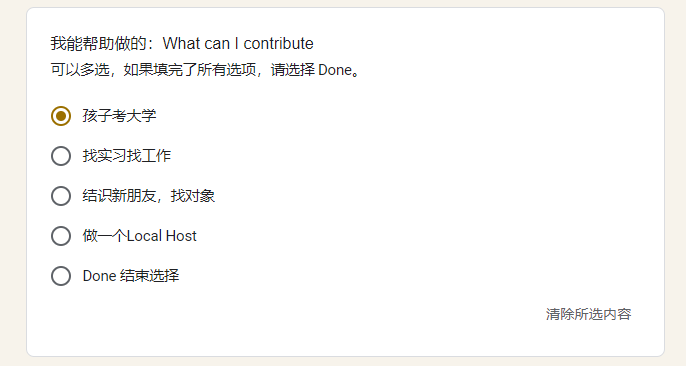
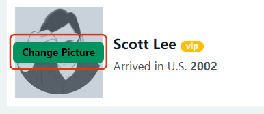
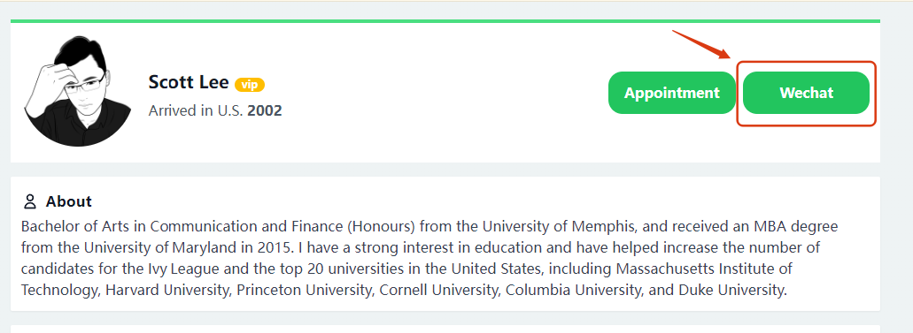
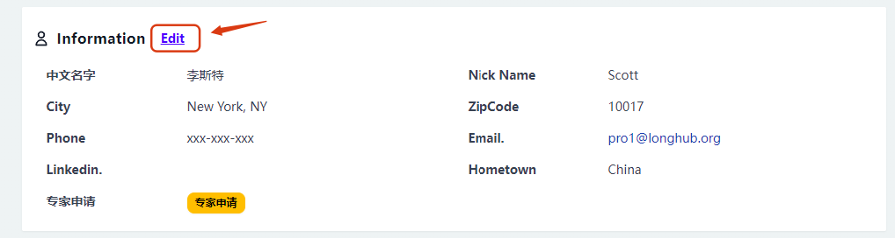
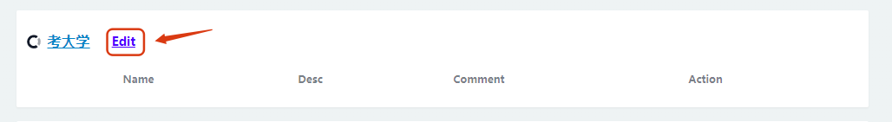
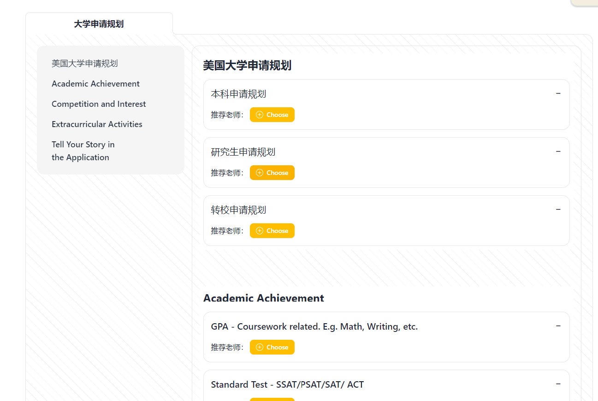
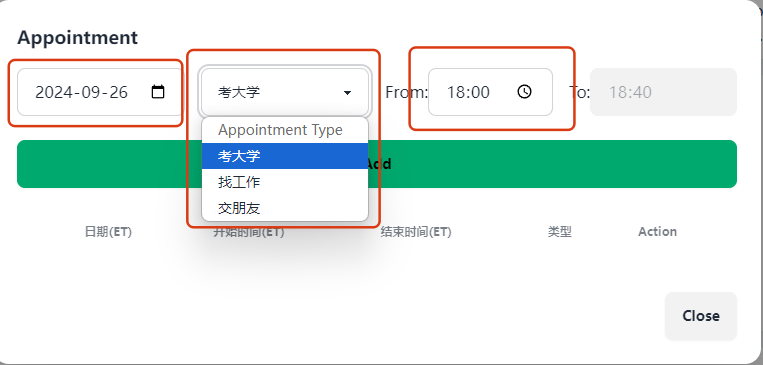
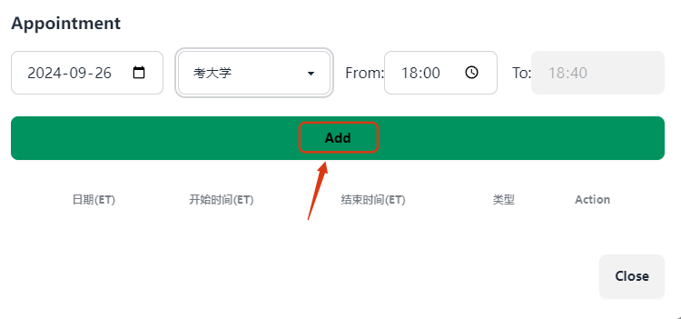

## 一、注册导师

进入LongHub官网：[https://longhub.org/](https://longhub.org/)

点击页面的`为了下一代 加入我们`按钮

### 1. 填写注册信息

填写注册表单，填写完成后会有注册信息发送到邮箱（注册填写的邮箱）

申请者选择填写成为我们的成为专家会员 
填写能够提供的服务领域以及服务项目

### 2.获取注册信息

登录注册填写的邮箱，在收件箱可以获取我们的账号信息以及Profile链接

### 3.审核

注册成为专家会员之后，会由LongHub管理员进行审核，审核通过后即可成为导师会员账号

## 二、Profile

### 1. 上传/修改头像

点击`Upload picture`或者`change picture`,即可上传/修改图片或者图片链接

### 2.设置微信二维码

点击`Wechat`,即可上传/修改微信二维码

### 3.修改个人信息

点击个人信息的`Edit`,即可修改个人信息

### 4.修改考大学可服务项目

点击考大学的`Edit`,即可修改考大学可服务项目

### 5.设置可预约时间段
点击`Appointment`，设置可预约、可预约项目以及可预约时间，点击`Add`即可生成可预约时间段

## 三、考大学

### 1. 学生评测邮件

