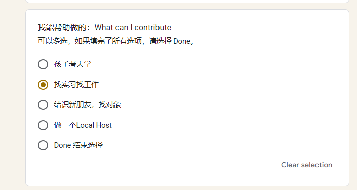
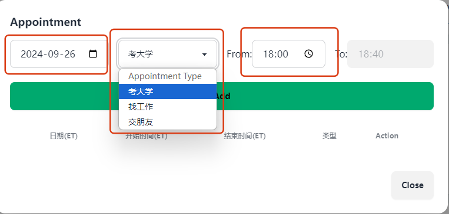
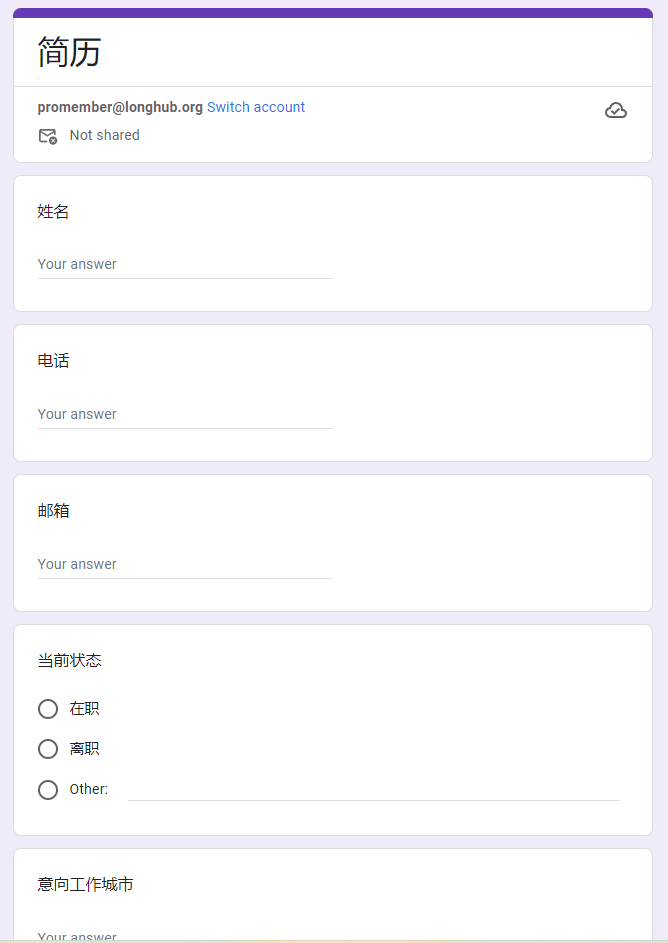
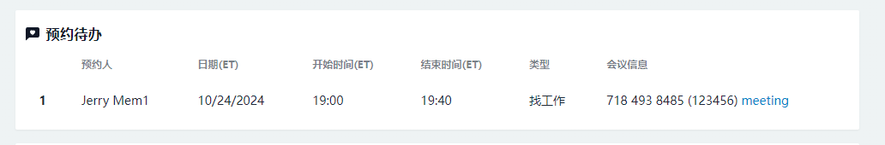

## 找工作-专家

## 一、注册专家

进入LongHub官网：[https://longhub.org/](https://longhub.org/)

点击页面的`为了下一代 加入我们`按钮

### 1. 填写注册信息

填写注册表单，填写完成后会有注册信息发送到邮箱（注册填写的邮箱）

申请者选择填写成为我们的成为专家会员

填写能够提供的服务领域以及服务项目

### 2.获取注册信息

登录注册填写的邮箱，在收件箱可以获取我们的账号信息以及Profile链接

### 3.设置可预约时间段
点击`Appointment`，设置可预约、可预约项目以及可预约时间，点击`Add`即可生成可预约时间段

## 二、找工作

### 1. 发布工作机会

点击Profile页面的`找工作`按钮，进入找工作界面

点击找工作界面右上角的Menu下拉菜单中的`JOBS`按钮

填写工作机会表单，即可发布工作岗位

### 1. 修改已发布的工作机会

进入Profile页面的`找工作`列表，可以对已发布的工作机会，做修改或者删除操作

### 3. 发布个人简历

点击找工作界面右上角的Menu下拉菜单中的`Resume`按钮

填写个人简历表单，即可发布个人简历信息到页面上

## 三、预约提醒

### 1. 预约邮件提醒

当有人预约自己的时候，会有个邮件提醒（包含了预约时间段以及会议信息）

### 2. 预约代办

当有人预约自己的时候，同时会显示在Profile的预约待办列表（包含了预约时间段以及会议信息）

