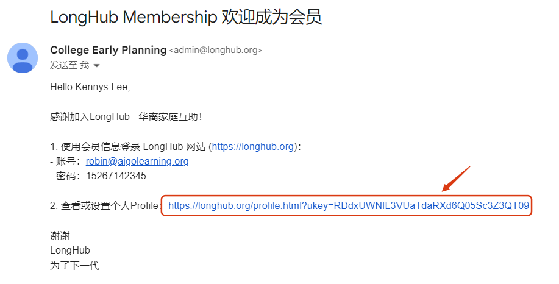
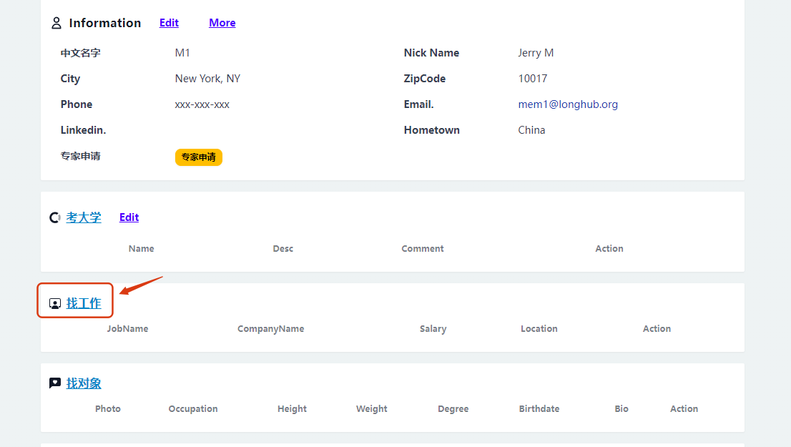
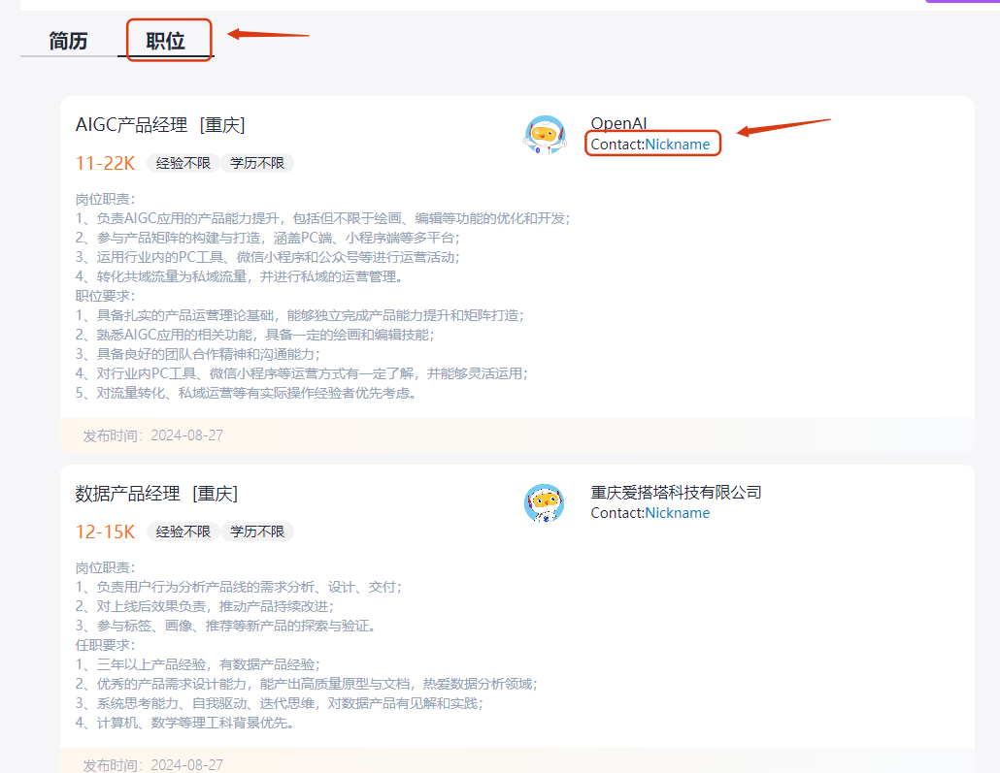
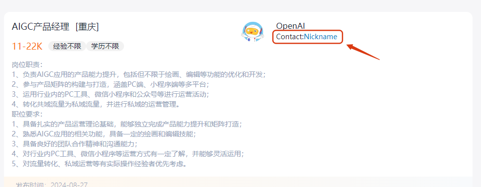
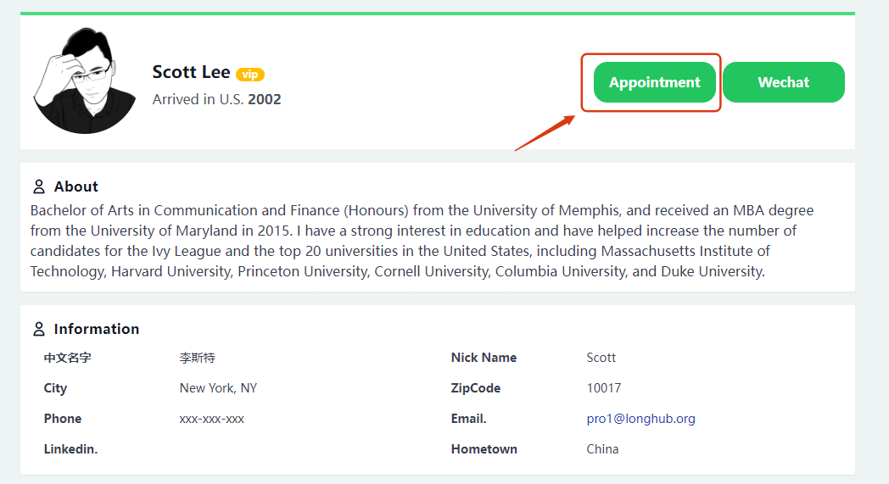
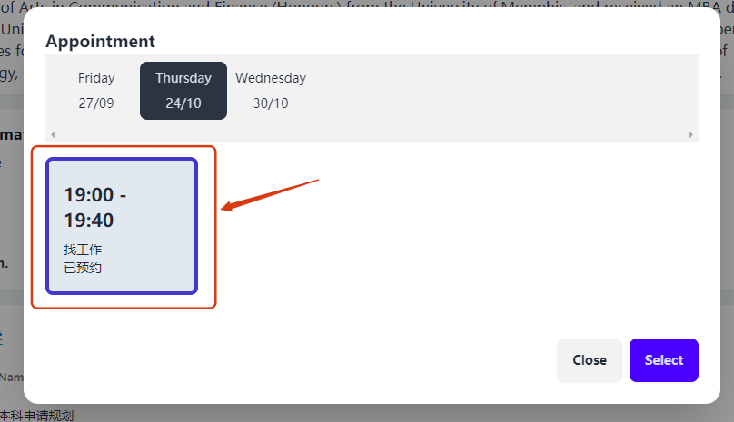
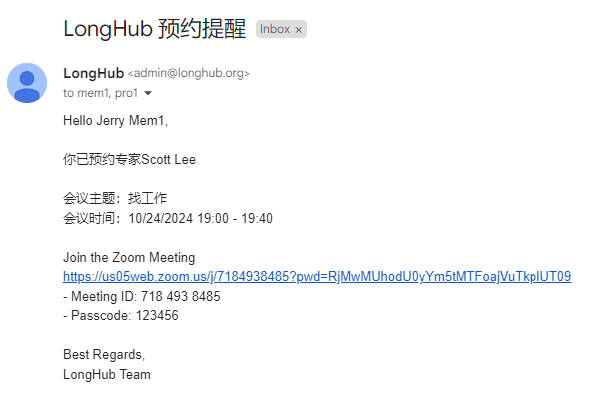
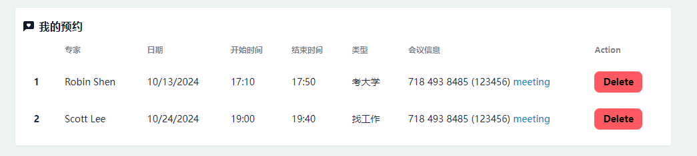

## 找工作-普通会员

## 一、注册会员

进入LongHub官网：[https://longhub.org/](https://longhub.org/)

点击页面的`为了下一代 加入我们`按钮

### 1. 填写注册信息

填写注册表单，填写完成后会有注册信息发送到邮箱（注册填写的邮箱）

申请者选择填写成为我们的成为会员

### 2.获取注册信息

登录注册填写的邮箱，在收件箱可以获取我们的账号信息以及Profile链接

## 二、Profile

点击注册邮件中的`个人Profile`链接，即可无需登录进入Profile页面

## 三、找工作

点击Profile页面的`找工作`，进入找工作页面

点击`简历`，可以预览他人上传的个人简历

然后点击`职位`，可以查看他人上传的工作岗位，如有意向可以点击联系人预约咨询

## 四、预约咨询

### 1. 预约咨询时间

如果对某个工作岗位有意向，可以点击工作岗位联系人，进入他的Profile页面，点击`Appointment`，即可选择可预约咨询时间段

### 2. 预约邮件提醒

当预约咨询后，会有个邮件提醒（包含了预约时间段以及会议信息）

### 3. 我的预约

当预约完成后，同时会显示在Profile的我的预约列表（包含了预约时间段以及会议信息）

