## 普通会员（家长）

## 二、注册会员

进入LongHub官网：[https://longhub.org/](https://longhub.org/)

点击页面的`为了下一代 加入我们`按钮

### 1. 填写注册信息

填写注册表单，填写完成后会有注册信息发送到邮箱（注册填写的邮箱）

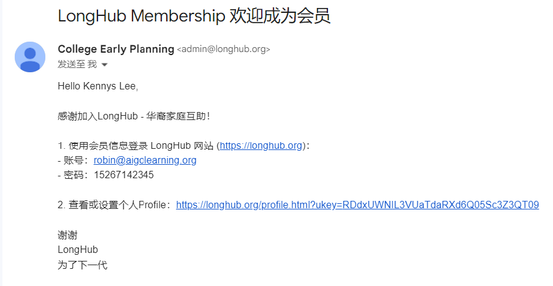

申请者选择填写成为我们的成为会员

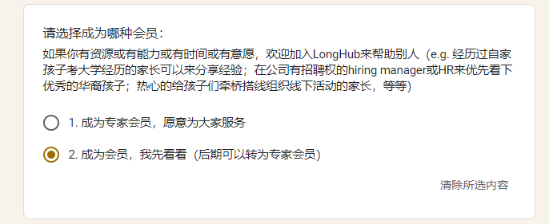

### 2.获取注册信息

登录注册填写的邮箱，在收件箱可以获取我们的账号信息以及Profile链接

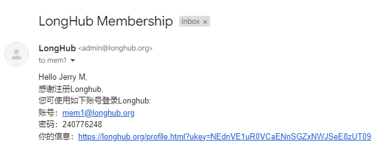

## 二、Profile

点击注册邮件中的`你的信息`链接，即可无需登录进入Profile页面

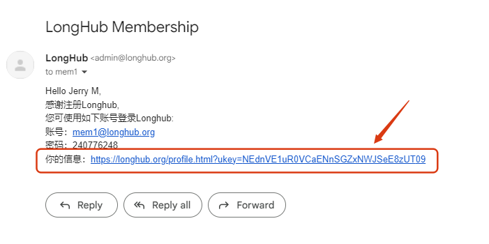

### 1. 上传/修改头像

点击`Upload picture`或者`change picture`,即可上传/修改图片或者图片链接

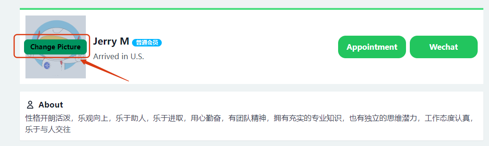
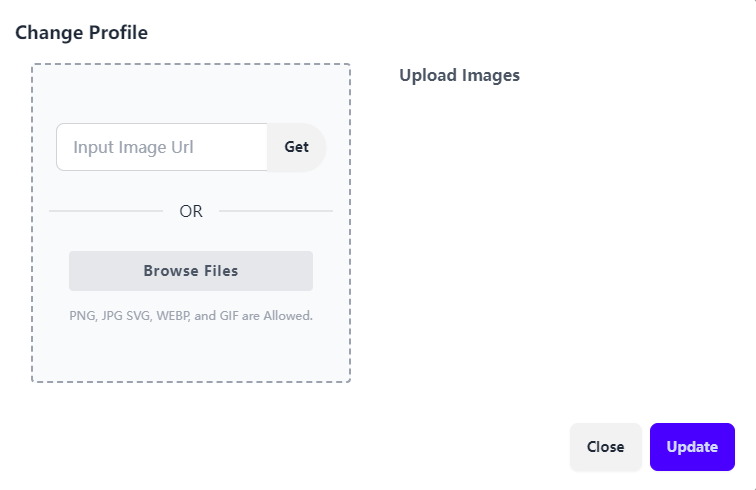

### 2.设置微信二维码

点击`Wechat`,即可上传/修改微信二维码

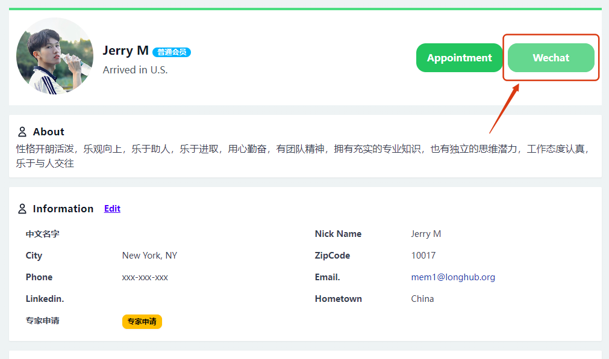
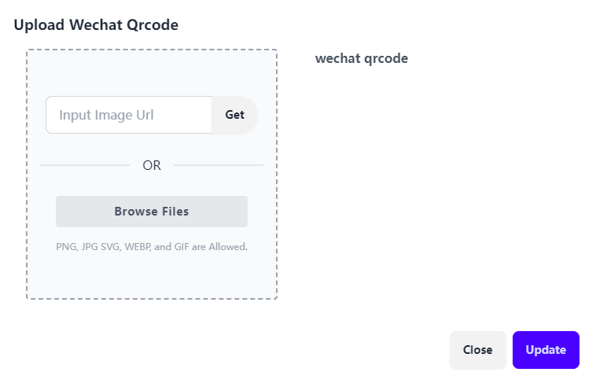

### 3.修改个人信息

点击个人信息的`Edit`,即可修改个人信息

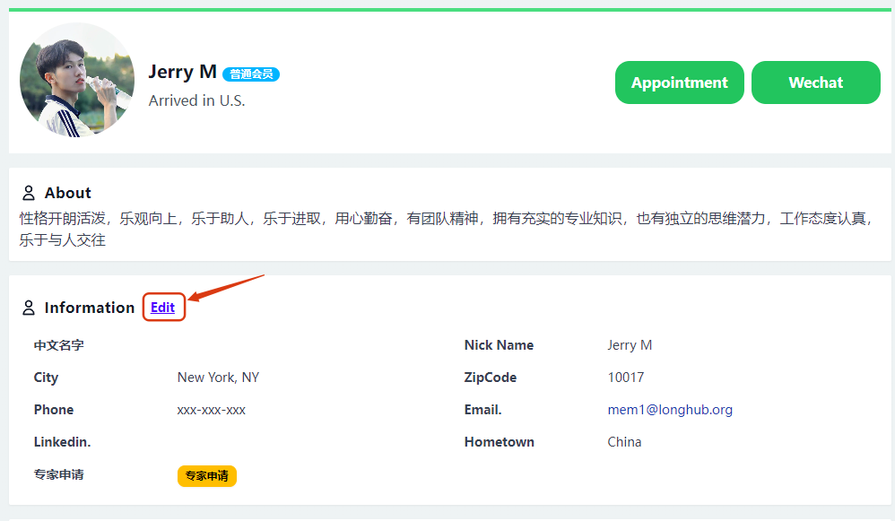

## 三、考大学

### 1. 添加孩子

### 2. 提交学生测评

当有学生提交测评信息表后，系统会自动发送测评邮件到导师邮箱

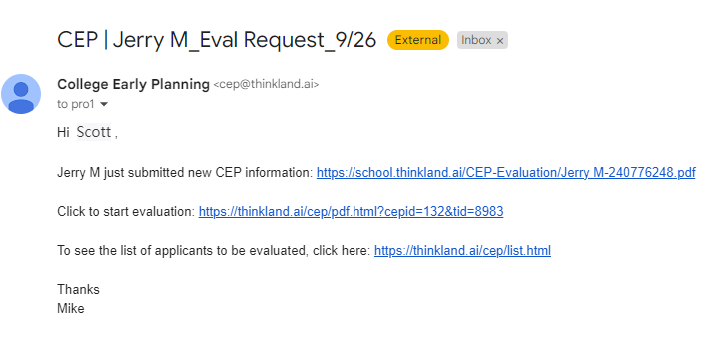

点击测评邮件中的evaluation链接，将进入点评页面

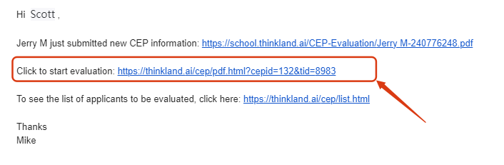
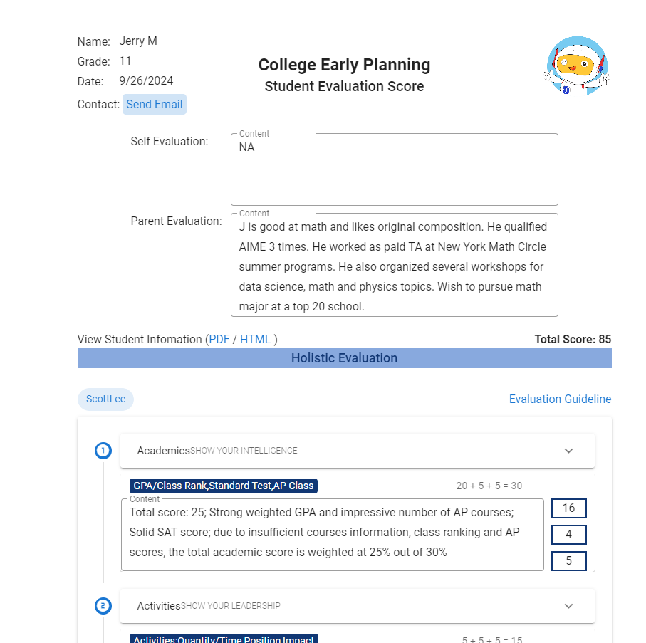

根据学生提交的信息，给学生做点评以及打分

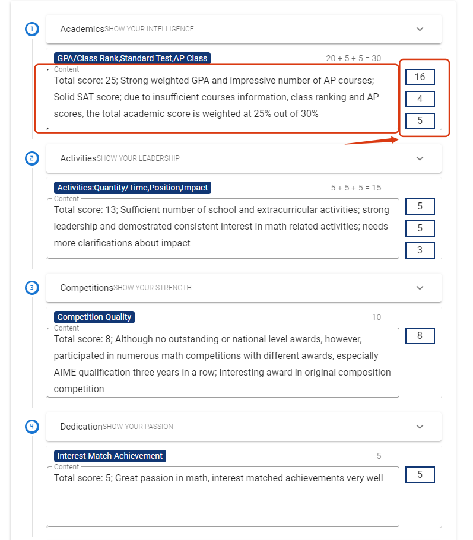

点评完成之后，点击`SUBMIT`提交报告

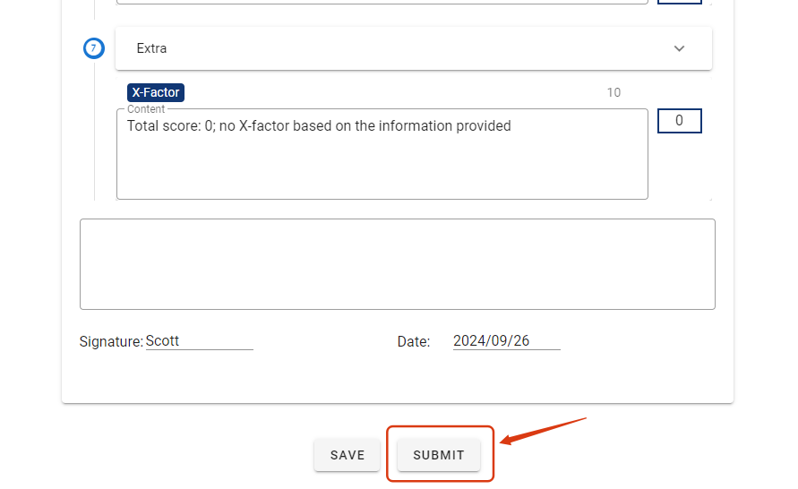

## 四、预约提醒

### 1. 预约邮件提醒

当有学生预约自己的时候，会有个邮件提醒（包含了预约时间段以及会议信息）

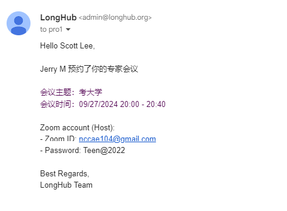

### 2. 预约代办

当有学生预约自己的时候，同时会显示在Profile的预约待办列表（包含了预约时间段以及会议信息）

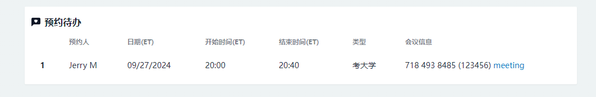

